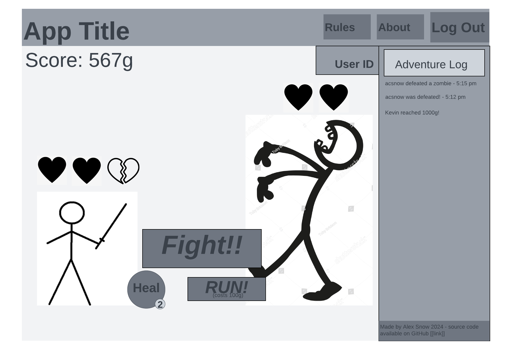

# startup

## Find my notebook [here](./notes.md)

## Specification Deliverable

### Elevator Pitch
Imagine a world of brave heroes and warmongering monsters that is available at your fingertips at any time. The world has simple rules: choose to fight or protect yourself. Valuable gold can be gained from battling brutes, but beware! There are dangerous risks at every turn. Jump into adventure, and don't worry if you don't have much time, you can pick up exactly where you left off whenever it is convenient. When you and your friends fight at the same time, you can see their successes and failures as you prove to them how strong of a hero you are. Fear not, traveler, and take on this challenge head-on!

### Design Images

### Key Features
- HTTPS Login
- Display player character and monster character
- Ability to choose to fight, heal, or run
    * Fighting removes one heart from the monster and has a chance of removing a heart from the player
    * Healing uses a limited, replenishable resource to restore one of the player's hearts
    * Running subtracts from the player's score but replenishes the healing resource by 1
- Finishing a fight, either by running or depleting the monster's hearts, displays a random different monster image (one of 2-5 monsters) and replenishes the monster's hearts
- Depleting all the monster's hearts results in the player's score increasing by a fixed amount depending on the type of monster
- Losing all the player character's hearts results in their score decreasing by a fixed amount depending on how high their score is
- Game state is persistently stored in database and linked to the user
    * Number of player hearts
    * Number of monster hearts
    * Which monster is being displayed
    * Amount of healing resource
    * Score
- The most recent important events are displayed for all users in the form of simple text and a timestamp; for example, when a user defeats a monster, all users, including the user who defeated the monster, see a message in the adventure log that says 
>*USERNAME* defeated a monster! 5:34 PM

### Technologies
- HTML: 
    * HTML will be used for the **login**, **game**, and **about** pages. 
- CSS:
    * Styling of all the pages will use CSS.
- Javascript:
    * The game's interactive elements will be coded in Javascript.
- Authentication:
    * Users will be asked to create an account before playing. This includes a username and password. Their chosen name will display on the game page.
- Database Data:
    * The current game state of each player will be stored in the database. This includes the following values:
        * Number of player hearts
        * Number of monster hearts
        * Which monster they are fighting
        * Amount of healing resource
        * Score
- WebSocket Data:
    * Certain game events trigger a message to appear on every user's screen. 

## 2/14/24 CSS Deliverable
### Changes: 
- **Header, footer, and main content body** all have separate styling. Header and footer are static sizes, main is dynamically sized.
- **Navigation elements** are displayed at the top of each page except the login page. To navigate to the play page from the login page, the user must enter a username and password. I used the navbar from Bootstrap but adjusted the placement of the nav items, as well as the colors.
- **Responsive to window resizing** - application responds to smaller and larger screen sizes by resizing images, adjusting text size, and wrapping some flex items.
- **Application elements** are present: buttons for interacting with the game (from Bootstrap), images for the game's visuals, the game log (with placeholder text), and the player's username and score (with placeholder text).
- **Application text content** is present on the play page (which will be dynamic in the future) and on the rules page. The fonts are consistent across the application. Font sizes on the play page are different sizes depending on their importance. 
- **Application images** are present on the play page. The size and the placement of these items was hard to adjust to make them easy to read and not too big. When they were too big they would push other items off the screen. I used flex mostly to get this result, but I also used relative height for the image sizes, and one transform on the player's hearts. 

## 2/28/24 Javascript Deliverable
### Changes:
- **Login support** - User can log in with username and password, and their username will display on the game page.
- **Database data support** - Game data is stored in Local Storage, including:
    - User score
    - Healing resource count
    - Player health
    - Enemy health
    - Type of enemy currently faced
- **WebSocket data support** - Game logs are displayed for what the player does in-game, and timeouts are used to display mock game logs from other players
- **Application interaction logic** - Game functions properly - player can fight (at their own risk), heal themselves, or choose to run. A random number generator API will be used to randomize the game functionality, such as randomizing when the player takes damage and what monster appears when one is defeated. 

## 3/11/24 Service Deliverable:
### Changes:
- **HTTP service through Node.js and Express**
- **Middleware** serves up front end files, including the html pages, game images, and javascript files
- **Third party service** provides random number generation to further randomize game events
- **Backend endpoints** allow user to save and load game data from anywhere, based on their username. Each username is also locked behind the password first used for it. 
- **Frontend calls backend endpoints** to check password on login, save game data after important game events, and load it on login. 
